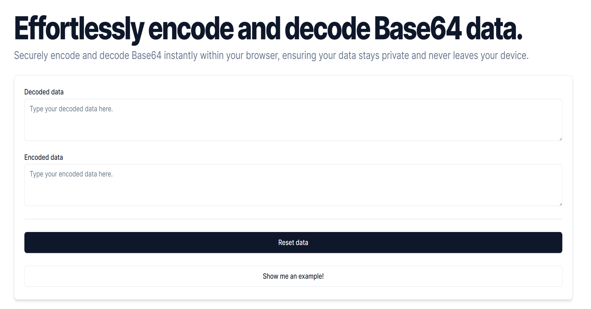

  <picture>
<svg xmlns="http://www.w3.org/2000/svg" width="100" viewBox="0 0 24 24" fill="none" stroke="currentColor" stroke-width="2" stroke-linecap="round" stroke-linejoin="round" class="lucide lucide-code"><polyline points="16 18 22 12 16 6"></polyline><polyline points="8 6 2 12 8 18"></polyline></svg>
</picture>

<h1 align="center">
  Base64
</h1>

  Securely encode and decode Base64 text instantly within your browser, ensuring your data stays private and never leaves your device.

Start using it today: <a href="https://base64.troypoulter.com/" target="_blank">base64.troypoulter.com</a>!

## Why build this?

I found the current online tools to encode and decode Base64 text either didn't update as you typed, required page refreshes or even send a request to an API to process it. I thought there should be a simpler way that adhered to three main requirements:

- **Real-time updates**: No more clicking buttons repeatedly. I wanted a tool that instantly reflected any changes I made.
- **Simultaneous updates**: The ability to modify either the encoded or decoded text and see the other update automatically, even if it meant amusing symbols when altering the encoded text.
- **Utmost privacy**: Above all, I sought a solution that assured me my data would not be sent or stored beyond the confines of my own browser. And with the code open-source here, hopefully that provides even more confidence!

If you're interested, check out my blog post [Why I built an Encode and Decode Base64 Web App](https://www.troypoulter.com/blog/why-i-built-an-encode-and-decode-base64-web-app/) to read more about this project's beginnings and how I made it.